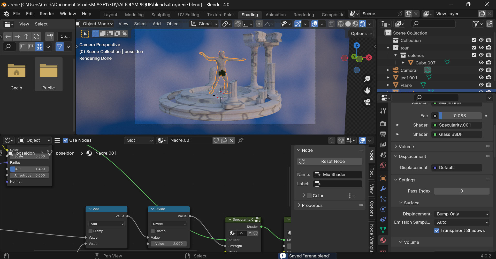

# Saltolympique

## Lien du jeux : https://saltoolympique.onrender.com/

# Description du Jeu

## Fonctionnement du Jeu

### Accès au Jeu

Pour accéder au jeu, suivez ces étapes simples :

1. **Entrer votre nom** : À l'écran d'accueil, saisissez votre nom pour commencer.
2. **Choisir votre personnage** : Sélectionnez un personnage parmi les options disponibles.

### Comment Jouer

Une fois dans le jeu, voici les contrôles et mécanismes à maîtriser :

1. **Charger le saut** :

   - Appuyez sur la barre espace pour charger la puissance de votre saut. Maintenez la barre espace enfoncée pour augmenter la puissance et relâchez-la pour sauter.

2. **Effectuer des figures** :

   - Utilisez les touches fléchées (haut, bas, gauche, droite) pour effectuer différentes figures acrobatiques en l'air. Chaque figure réussie vous rapporte des points.

3. **Atterrissage** :
   - Assurez-vous de bien retomber sur vos pieds à la fin de chaque saut. Un atterrissage raté annulera le saut et vous ne gagnerez pas de points pour cette tentative.

### Objectif du Jeu

L'objectif est de réaliser le meilleur score possible en une minute. Enchaînez les sauts et les figures tout en veillant à réussir vos atterrissages pour maximiser vos points.

## Partie Artistique

### Thème et Design

Le thème central du jeu est la Grèce antique, en hommage aux origines des Jeux Olympiques. Voici les principaux éléments artistiques qui illustrent ce thème :

1. **L'Arène** :

   - Le jeu se déroule dans les ruines de la Grèce antique.

2. **Le Personnage** :
   - Votre personnage est représenté comme une statue grecque. Avec des traits sculptés dans le style des œuvres classiques, le personnage incarne la grâce et la puissance des athlètes antiques.

### Musique de Fond

Pour renforcer l'atmosphère immersive, nous avons créé une musique de fond originale qui accompagne le jeu. Cette composition intègre des instruments à cordes dont les sonorités évoquent l'Antiquité, ajoutant une dimension épique et historique à votre expérience de jeu.

## Développement du Jeu

### Moteur de Jeu et Technologies Utilisées

Nous avons développé le jeu en utilisant Babylon.js.

### Gameplay

Voici les principales fonctionnalités du gameplay que nous avons implémentées :

- **Contrôles du Jeu** : Nous avons défini les différentes touches et actions du jeu, permettant aux joueurs d'interagir avec le personnage et l'environnement de l'arène.
- **Système de Score** : Le score s'accumule progressivement à chaque saut et est synchronisé avec un chronomètre. Les points gagnés sont affichés en temps réel à l'écran.
- **Animations du Personnage** : Le personnage réagit aux actions du joueur en exécutant des animations correspondantes.
- **Interface Utilisateur (UI)** : Nous avons mis en place une interface utilisateur qui permet aux joueurs d'entrer leur nom et de choisir leur personnage. Actuellement, seul un personnage est disponible, mais d'autres pourraient être ajoutés à l'avenir.
- **Scoring et Leaderboard** : Nous avons intégré un système de score qui enregistre les performances des joueurs dans un leaderboard. Les cinq meilleurs scores sont affichés à l'écran.
- **Rejouabilité** : Le jeu est conçu pour être rejouable, avec un système de score qui encourage les joueurs à améliorer leurs performances à chaque tentative.
- **Quittez le Jeu** : Les joueurs peuvent quitter apres avoir finis une partis et par exemple s'il le souhaite changer de pseudo.

### Modélisation 3D

Pour créer l'environnement visuel du jeu, nous avons utilisé Blender pour modéliser l'arène grecque.

Nous avons utilisé un modele de statue trouvé sur sketchfab en CC0 pour notre personnage.

Il a fallu le mettre en T-pose pour l'utiliser avec mixamo. Nous avons alors pu ajouter des animations au personnage.

Tout les fichiers Blender sont diponibles dans le repo.

### Gestion des Scores

Nous avons développé un serveur utilisant Node.js pour gérer les scores des joueurs. Les données sont stockées dans une base de données MongoDB, hébergée sur Render.com.
Voici le lien du serveur : [https://gow-olympic-edition-saltolympique.onrender.com/scores](https://gow-olympic-edition-saltolympique.onrender.com/scores)
Ce système permet de conserver les cinq meilleurs scores des joueurs, ajoutant ainsi une dimension compétitive au jeu et encourageant les joueurs à améliorer leurs performances.

# Membres du groupe

- Patrick Fernandes De Faria
- Léo Robin
- Cécile Barouk
